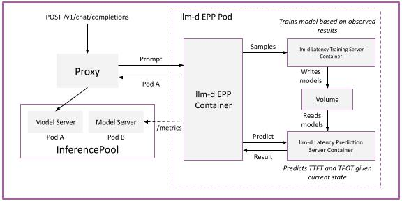

# llm-d-latency-predictor

[](https://github.com/llm-d/llm-d-latency-predictor/actions/workflows/ci-pr-checks.yaml)
[](LICENSE)

> **Latency prediction service for the llm-d ecosystem.**

## Overview

`llm-d-latency-predictor` is the ML training and serving component behind
[predicted latency-based scheduling](https://llm-d.ai/blog/predicted-latency-based-scheduling-for-llms)
in the [llm-d](https://github.com/llm-d/llm-d) ecosystem.

It runs two FastAPI services as sidecars to the Endpoint picker:

- **Training server** — ingests observed request traces (TTFT / TPOT and load features) after a completed request and periodically retrains regression models (XGBoost by default; LightGBM and Bayesian Ridge also supported).
- **Prediction server** — syncs those models and serves low-latency TTFT / TPOT predictions for candidate pods based on the features such as KV-cache utilization, queue depth, prefix-cache score, and running requests.

The EPP's predicted-latency plugins call the prediction API at schedule time to score endpoints, then feed completed-request metrics back to the training server so models in real-time. That enables routing on predicted p90 TTFT/TPOT (optionally against per-request SLOs) instead of utilization.

## Prerequisites

- Python 3.11+
- Docker (for container builds)
- [pre-commit](https://pre-commit.com/) (for local development)

## Quick Start

```bash
# Clone the repo
git clone https://github.com/llm-d/llm-d-latency-predictor.git
cd llm-d-latency-predictor

# Install pre-commit hooks
pre-commit install

# Install Python dependencies
make install

# Run tests
make test

# Run linters
make lint
```

## Development

See [CONTRIBUTING.md](CONTRIBUTING.md) for development guidelines, coding standards, and how to submit changes.

### Common Commands

```bash
make help           # Show all available targets
make install        # Install Python dependencies
make test           # Run Python tests
make lint           # Run Python linter (ruff)
make fmt            # Format Python code
make image-build    # Build container images (prediction, training, test)
make pre-commit     # Run pre-commit hooks
```

### Layout

```text
common/
  types.py                    # Shared enums and model types
prediction/
  prediction_server.py        # FastAPI prediction server (serves latency predictions)
  Dockerfile                  # Image for the prediction server
training/
  training_server.py          # FastAPI training server (trains models from request traces)
  Dockerfile                  # Image for the training server
tests/
  test_dual_server_client.py  # integration / load-test client exercising both servers
  Dockerfile                  # Image that runs the test client as a Job
deploy/                       # Kubernetes manifests and kustomization
build-deploy.sh               # Helper script for building images and deploying to GKE
```

After `make install`, the servers can be run with:

```bash
uvicorn prediction.prediction_server:app --port 8001
uvicorn training.training_server:app --port 8000
```

## Architecture




1. A chat completion request hits the proxy, which consults the EPP.
2. The EPP calls the prediction server with current pod state and request features.
3. Predictions guide pod selection; the proxy routes the request into the InferencePool.
4. After serving, the EPP sends samples to the training server, which writes updated models to the shared volume for the prediction server to read.

## Configuration

<!-- TODO: Document configuration options, environment variables, CLI flags -->

## Contributing

We welcome contributions! Please see [CONTRIBUTING.md](CONTRIBUTING.md) for guidelines.

All commits must be signed off (DCO). See [PR_SIGNOFF.md](PR_SIGNOFF.md) for instructions.

## Security

To report a security vulnerability, please see [SECURITY.md](SECURITY.md).

## License

This project is licensed under the Apache License 2.0 - see [LICENSE](LICENSE) for details.
